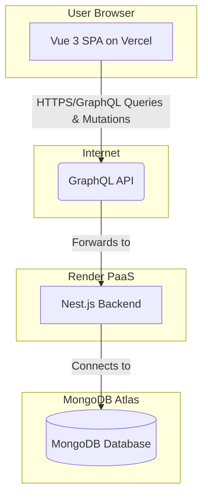

# MadPlan Architecture

## MadPlan Fullstack Architecture Document

### Introduction

[cite\_start]This document outlines the complete fullstack architecture for MadPlan, including the backend systems, frontend implementation, and their integration[cite: 881]. [cite\_start]It serves as the single source of truth for AI-driven development, ensuring consistency across the entire technology stack[cite: 881]. [cite\_start]This unified approach combines backend and frontend architecture to streamline development for a modern application where these concerns are tightly coupled[cite: 882].

#### Starter Template or Existing Project

[cite\_start]N/A - This is a **Greenfield** project[cite: 887]. [cite\_start]The architecture will be designed from scratch, but development will be accelerated by using industry-standard command-line interfaces (CLIs) for project scaffolding[cite: 1085]:

  - **Frontend:** Vite CLI for initializing the Vue 3 project.
  - **Backend:** NestJS CLI for initializing the backend project.

#### Change Log

| Date | Version | Description | Author |
| :--- | :--- | :--- | :--- |
| 2025-08-27 | 1.0 | Initial architecture design based on PRD v1.0. | Winston, Architect |

-----

### High Level Architecture

#### Technical Summary

[cite\_start]The architecture for MadPlan is a **Polyrepo** system composed of a **Vue 3** single-page application for the frontend and a **Nest.js** application for the backend[cite: 897]. [cite\_start]Communication between the two will be handled exclusively through a **GraphQL API**[cite: 891]. [cite\_start]Data persistence will be managed by a **MongoDB** database hosted on MongoDB Atlas[cite: 891]. [cite\_start]The frontend will be deployed on **Vercel** for optimal performance and the backend on **Render** for simplicity and scalability, creating a robust, modern, and developer-friendly stack designed to meet the MVP goals outlined in the PRD[cite: 891].

#### Platform and Infrastructure Choice

  - **Platform:** A combination of best-in-class Platform-as-a-Service (PaaS) providers to accelerate development.
  - **Key Services:**
      - **Vercel:** Frontend hosting (Vue 3 application). Provides CI/CD, global CDN, and HTTPS by default.
      - **Render:** Backend hosting (Nest.js application). Provides CI/CD, managed SSL, and simple scaling.
      - **MongoDB Atlas:** Managed database hosting. Provides a free tier, automated backups, and high availability.
  - [cite\_start]**Deployment Host and Regions:** Vercel (Global Edge Network), Render (US-East), MongoDB Atlas (us-east-1)[cite: 896].

#### Repository Structure

  - [cite\_start]**Structure:** **Polyrepo**[cite: 897]. Two separate Git repositories will be maintained: `madplan-frontend` and `madplan-backend`. This approach allows for independent development, testing, and deployment cycles for the frontend and backend teams/agents.

#### High Level Architecture Diagram



#### Architectural Patterns

  - [cite\_start]**Component-Based UI:** The frontend will be built using reusable Vue 3 components, promoting maintainability and consistency[cite: 903].
  - **Client-Side State Management (Pinia):** A centralized Pinia store will manage global UI state, such as user authentication status.
  - [cite\_start]**Repository Pattern (Backend):** The backend will abstract data access logic into dedicated repository classes[cite: 903]. [cite\_start]This decouples business logic from data persistence, simplifying testing and future data source changes[cite: 905].
  - **Dependency Injection (Backend):** Leveraging Nest.js's built-in DI container to manage class dependencies, promoting modularity and testability.

-----

### Tech Stack

[cite\_start]This table is the single source of truth for all technologies and versions to be used in the project[cite: 907].

| Category | Technology | Version | Purpose | Rationale |
| :--- | :--- | :--- | :--- | :--- |
| Frontend Language | TypeScript | \~5.4.5 | Type safety for Vue app | Reduces runtime errors, improves developer experience. |
| Frontend Framework | Vue 3 | \~3.4.21 | Core UI framework | Modern, performant, and excellent tooling via Vite. |
| UI Component Library | Tailwind CSS | \~3.4.3 | Utility-first CSS | Allows for rapid custom styling to achieve the Ghibli look. |
| State Management | Pinia | \~2.1.7 | Global state for Vue | Simple, type-safe, and the official recommendation for Vue. |
| Backend Language | TypeScript | \~5.4.5 | Type safety for Nest.js app | Consistent language across the stack, robust and scalable. |
| Backend Framework | Nest.js | \~10.3.0 | Core backend framework | Opinionated, modular architecture perfect for GraphQL APIs. |
| API Style | GraphQL | 16.8.1 | API communication layer | Efficient data fetching, strongly typed, reduces over-fetching. |
| Database | MongoDB | 7.0+ | Primary data store | Flexible document model suits the nested structure of boards. |
| Frontend Testing | Vitest | \~1.5.0 | Unit/Integration testing | Modern test framework designed for Vite, fast and simple. |
| Backend Testing | Jest | \~29.7.0 | Unit/Integration testing | Default, well-integrated test runner for Nest.js. |
| E2E Testing | Cypress | \~13.7.2 | End-to-end testing | Robust testing of user flows across the full stack. |
| CI/CD | GitHub Actions| v4 | Automated build/deploy | Native to GitHub, easy to configure for Vercel/Render. |

-----

### Data Models

#### User

  - **Purpose:** Represents an application user for authentication and ownership.
  - **Key Attributes:**
      - `id`: string - Unique identifier.
      - `email`: string - User's email for login (unique).
      - `password`: string - Hashed password.

<!-- end list -->

```typescript
// TypeScript Interface
interface User {
  id: string;
  email: string;
}
```

#### Board

  - **Purpose:** Represents a user's project board, a container for lists.
  - **Key Attributes:**
      - `id`: string - Unique identifier.
      - `title`: string - The name of the board.
      - `ownerId`: string - The ID of the user who owns the board.
      - `listOrder`: string[] - An array of List IDs to maintain order.

<!-- end list -->

```typescript
// TypeScript Interface
interface Board {
  id: string;
  title: string;
  ownerId: string;
  lists: List[];
  listOrder: string[];
}
```

#### List

  - **Purpose:** Represents a column on a board (e.g., "To Do", "In Progress").
  - **Key Attributes:**
      - `id`: string - Unique identifier.
      - `title`: string - The name of the list.
      - `boardId`: string - The ID of the board it belongs to.
      - `cardOrder`: string[] - An array of Card IDs to maintain order.

<!-- end list -->

```typescript
// TypeScript Interface
interface List {
  id: string;
  title: string;
  boardId: string;
  cards: Card[];
  cardOrder: string[];
}
```

#### Card

  - **Purpose:** Represents a single task or item within a list.
  - **Key Attributes:**
      - `id`: string - Unique identifier.
      - `content`: string - The text content of the card.
      - `listId`: string - The ID of the list it belongs to.

<!-- end list -->

```typescript
// TypeScript Interface
interface Card {
  id: string;
  content: string;
  listId: string;
}
```

-----

### API Specification

#### GraphQL Schema

[cite\_start]This is the initial schema definition to support the MVP requirements[cite: 918].

```graphql
type User {
  id: ID!
  email: String!
}

type AuthPayload {
  token: String!
  user: User!
}

type Card {
  id: ID!
  content: String!
}

type List {
  id: ID!
  title: String!
  cards: [Card!]!
  cardOrder: [ID!]!
}

type Board {
  id: ID!
  title: String!
  lists: [List!]!
  listOrder: [ID!]!
}

type Query {
  # Get all boards for the authenticated user
  myBoards: [Board!]!
  # Get a single board by its ID
  board(id: ID!): Board
}

type Mutation {
  # Auth
  register(email: String!, password: String!): AuthPayload!
  login(email: String!, password: String!): AuthPayload!

  # Board
  createBoard(title: String!): Board!
  deleteBoard(id: ID!): Boolean

  # List
  createList(boardId: ID!, title: String!): List!
  updateList(id: ID!, title: String): List
  deleteList(id: ID!): Boolean
  reorderList(listId: ID!, newIndex: Int!): Board

  # Card
  createCard(listId: ID!, content: String!): Card!
  updateCard(id: ID!, content: String): Card
  deleteCard(id: ID!): Boolean
  reorderCard(cardId: ID!, sourceListId: ID!, destListId: ID!, newIndex: Int!): Board
}
```

-----

### Unified Project Structure

As a **Polyrepo**, the project will consist of two independent repositories.

#### Frontend (`madplan-frontend/`)

```plaintext
madplan-frontend/
├── public/
├── src/
│   ├── assets/             # Ghibli-themed images, fonts, etc.
│   ├── components/         # Reusable Vue components (Board, List, Card)
│   ├── views/              # Page components (LoginView, DashboardView)
│   ├── router/             # Vue Router configuration
│   ├── stores/             # Pinia state management stores (auth.ts)
│   ├── services/           # GraphQL API communication layer
│   └── main.ts             # App entry point
├── package.json
└── vite.config.ts
```

#### Backend (`madplan-backend/`)

```plaintext
madplan-backend/
├── src/
│   ├── auth/               # Authentication module (JWT strategy, resolvers)
│   ├── users/              # User module (service, resolver, schema)
│   ├── boards/             # Boards module (service, resolver, schema)
│   ├── shared/             # Shared utilities
│   ├── app.module.ts
│   └── main.ts
├── test/
└── package.json
```

-----

### Development Workflow

#### Local Development Setup

1.  [cite\_start]Clone both `madplan-frontend` and `madplan-backend` repositories[cite: 970].
2.  [cite\_start]Run `npm install` in both directories[cite: 971].
3.  [cite\_start]Create a `.env` file in the backend project for database connection strings and JWT secrets[cite: 975].
4.  [cite\_start]Create a `.env.local` file in the frontend project for the GraphQL API endpoint URL[cite: 975].

#### Development Commands

```bash
# In madplan-backend directory
npm run start:dev

# In madplan-frontend directory
npm run dev
```

-----

### Deployment Architecture

  - **Frontend Deployment:** The Vue 3 application will be connected to a Vercel project. [cite\_start]Every `git push` to the `main` branch will trigger an automatic build and deployment to production[cite: 979].
  - **Backend Deployment:** The Nest.js application will be connected to a Render project. [cite\_start]Every `git push` to the `main` branch will trigger an automatic build and deployment[cite: 980].
  - **Database:** The MongoDB Atlas cluster is managed independently. The connection string will be provided to the Render backend via environment variables.

-----

### Security and Performance

#### Security Requirements

  - **Authentication:** User authentication will be handled using JSON Web Tokens (JWT). The backend will issue a token upon successful login, which the frontend must include in the `Authorization` header for all subsequent GraphQL requests.
  - **Data Security:** Passwords will be hashed using `bcrypt` before being stored in the database. All communication between client, backend, and database must use TLS/SSL (handled by PaaS providers).
  - [cite\_start]**Input Validation:** Nest.js pipes and GraphQL input types will be used to validate all incoming data to prevent injection attacks[cite: 983].

#### Performance Optimization

  - **Frontend:** Vite provides excellent code-splitting and tree-shaking out of the box to keep the initial bundle size small. [cite\_start]Images used for theming will be optimized for the web[cite: 985].
  - [cite\_start]**Backend:** Proper indexing will be applied to the MongoDB collections, particularly on `ownerId` and `boardId`, to ensure fast lookups[cite: 986].
  - [cite\_start]**API:** GraphQL allows the frontend to request only the data it needs, minimizing payload size[cite: 985].
